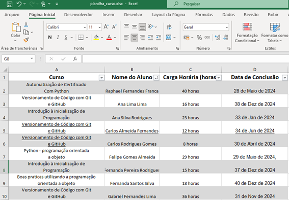

<h1>Gerador de Certificados Automático</h1>

 Descrição:  Este repositório contém o código Python para gerar certificados personalizados a partir de uma planilha Excel. O código utiliza a biblioteca openpyxl para ler dados da planilha e a biblioteca Pillow para criar e editar imagens.

<h3>Clonar o Projeto</h3>

Você pode realizar o download diretamente no <a href="https://github.com/RaphaelFF/automacao_certificado.git">github</a> ou realizar o clone diretamente do terminal.

<pre class="wp-block-code"><code>git clone https://github.com/RaphaelFF/automacao_certificado</code></pre>

---

<h1>Funcionalidade</h1>

- Lê dados de uma planilha Excel contendo informações sobre os alunos, como nome, curso, carga horária e data de conclusão.
  Gera um certificado personalizado para cada aluno usando uma imagem de modelo e preenchendo os campos com os dados do aluno.
  Salva os certificados personalizados em uma pasta específica.

<h3>Planilha Excel</h3>
  
<h3>Imagem Modelo</h3>
  
<h3>Imagem preenchida automaticamente com dados da planilha</h3>
  
  

---

<h1>Pré-requisitos:</h1>

- Python 3 ou superior
- Bibliotecas openpyxl e Pillow instaladas

---

<h1>Como usar:</h1>

- Clone este repositório em seu computador. 

  <pre class="wp-block-code"><code>git clone https://github.com/RaphaelFF/automacao_certificado</code></pre>
  
- Certifique-se de intsalar as bibliotecas.

  <pre class="wp-block-code"><code>pip install openpyxl</code></pre>
  <pre class="wp-block-code"><code>pip install Pillow</code></pre>
  
  
- Substitua o arquivo **planilha_curso.xlsx** pelo seu arquivo de planilha contendo os dados dos alunos.
  
- Execute o código Python usando o seguinte comando:

  <pre class="wp-block-code"><code>python automacao_certificado.py</code></pre>

  ---
  
<h1>Observações:</h1>

O código utiliza uma imagem de modelo chamada certificado-padrao.jpg. Você pode substituir essa imagem por outra de sua preferência.
Os certificados personalizados serão salvos na pasta certificados_salvos.
O código pode ser facilmente adaptado para atender às suas necessidades específicas.
